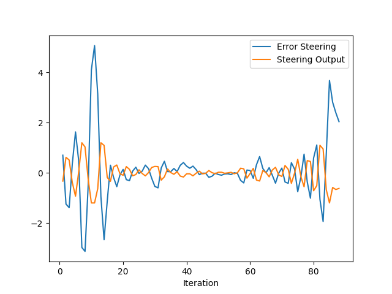
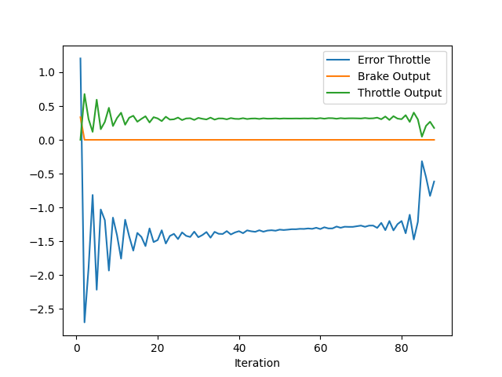

# Report : Control and Trajectory Tracking for Autonomous Vehicle
This project is built on Carla-simulator API, with path planning moduel generate multiple spirals given start and stop position and obstacles, and controler based on PID. 
This report will cover the following: 
- project setup
- project structure    
- PID control 
- Experiment 
- Final thoughts 

## project setup
### note: follow the setup from the repo below 
1. clone this [repo](https://github.com/udacity/nd013-c6-control-starter)
2. install [carla](https://carla.readthedocs.io/en/latest/start_quickstart/)
    - there is issue with carla on ubuntu 20.04 
3. run carla simulator by :
    - cd /opt/carlar-simulator 
    - SDL_VIDEODRIVER=offscreen ./CarlaUE4.sh -opengl
4. install necessary library by running ./project/install-ubuntu.sh
    - simulatorAPI.py implements uWS websocket to pass command from main.cpp to carlar backend
    - main.cpp nad simulatorAPI.py is client/server type connection 
5. re-install reclib
    - rm -rf rpclib
    - git clone https://github.com/rpclib/rpclib.git
6. compile the target
    - cd /project/pid_controller
    - cmake .
    - make -j12 
7. testing 
    - carla simulator started 
    - ./project/run_main_pid
    - this will fail silently, so start again 

# project structure 
### impression based on repo code, entry point: main.cpp & simulatorAPI.py 
1. establish server/client uWS socket connection, simulatorAPI.py <->main.cpp. 
2. a few initialization in main() and API setup in simulatorAPI.py asynchronosly (@asyncio.coroutine) 
3. h.onMessage()  is the part where multiple trajectory are generated and best is selected
    3.1 path_planner() doing all the heavy lifting in generate trajectory 
	3.2 goal is generated by behavior
	3.3 spirals is generated based on the ego and goal 
	3.4 for each spirals a velocity profile is generated 
	3.5 based on multiple criteira( only collision and goal distance implemented), best trajectory is selected as the control's target
4. simulatorAPI.py to send signal to drive the actor and report collision, etc 

# PID control
PID stands for Proportional-Integral-Derivative. These three controllers are combined in such a way that it produces a control signal. This is how the vehicle uses steering, throttle, and brake to move through the world, executing a trajectory created by the path planning block.

## PID Controller components
##### credit to [repo](https://github.com/dkarunakaran/carnd-pid-control-term2-p3/blob/master/README.md) 
### Error
error item is anything that thru minimizing also achieve goal. 
A cross track error is a distance of the vehicle from trajectory. In theory its best suited to control the car by steering in proportion to Cross Track Error(CTE).

### P component
It sets the steering angle in proportion to CTE with a proportional factor tau.

```
-tau * cte
```

In other words, the P, or "proportional", component had the most directly observable effect on the cars behavior. It causes the car to steer proportional (and opposite) to the cars distance from the lane center(CTE) - if the car is far to the right it steers hard to the left, if its slightly to the left it steers slightly to the right.

### D component
Its the differential component of the controller which helps to take temporal derivative of error. This means when the car turned enough to reduce the error, it will help not to overshoot through the x axis.

In other words, the D, or "differential", component counteracts the P components tendency to ring and overshoot the center line. A properly tuned D parameter will cause the car to approach the center line smoothly without ringing.

```
diff_cte = cte - prev_cte
prev_cte = cte
- tau_d * diff_cte
```

### I component
Its the integral or sum of error to deal with systematic biases.

In other words, the I, or "integral", component counteracts a bias in the CTE which prevents the P-D controller from reaching the center line. This bias can take several forms, such as a steering drift , but I believe that in this particular implementation the I component particularly serves to reduce the CTE around curves.

```
int_cte += cte
tau_i * int_cte

```

And combination of these we can get PID controller to control the steering value.

```
cte = robot.y
diff_cte = cte - prev_cte
prev_cte = cte
int_cte += cte
steer = -tau_p * cte - tau_d * diff_cte - tau_i * int_cte

```

Parameter optimisation can be done manually or using Twiddle algorithm.

Pseudocode for implementing the Twiddle algorithm is as follows:

```
function(tol=0.2) {
    p = [0, 0, 0]
    dp = [1, 1, 1]
    best_error = move_robot()
    loop untill sum(dp) > tol
        loop until the length of p using i
            p[i] += dp[i]
            error = move_robot()

            if err < best_err
                best_err = err
                dp[i] *= 1.1
            else
                p[i] -= 2 * dp[i]
                error = move_robot()

                if err < best_err
                    best_err = err
                    dp[i] *= 1.1
                else
                    p[i] += dp[i]
                    dp[i] *= 0.9
    return p
}
```

## Effect of the P, I, D components

The P, or "proportional", component had the most directly observable effect on the cars behavior. It causes the car to steer proportional (and opposite) to the cars distance from the lane center(CTE) - if the car is far to the right it steers hard to the left, if its slightly to the left it steers slightly to the right.

I got the P value with oscillating behaviour when I set the value to 0.05 and I and D set to zero

Here is the video with P value set to above:

<a href="http://www.youtube.com/watch?feature=player_embedded&v=iw3D3nSbdPc" target="_blank"></a>

The D, or "differential", component counteracts the P components tendency to ring and overshoot the center line. A properly tuned D parameter will cause the car to approach the center line smoothly without ringing.

Then found the D value that stops the oscillating behaviour which is set to 1.5 alogn with 0.05 for P and zero for I.

Here is the video after value for P and D as above:

<a href="http://www.youtube.com/watch?feature=player_embedded&v=Bj98Vr3Vxho" target="_blank"></a>

The I, or "integral", component counteracts a bias in the CTE which prevents the P-D controller from reaching the center line. This bias can take several forms, such as a steering drift , but I believe that in this particular implementation the I component particularly serves to reduce the CTE around curves.

In the case of the simulator, no bias is present. We set value to zero.


## Finding the right coefficients

The intial value for Kp, Ki, Kd selected using trail and error method. It is a simple method of PID controller tuning. In this method, first we have to set Ki and Kd values to zero and increase proportional term (Kp) until system reaches to oscillating behavior. Then Kd was tuned to reduced oscillation and then Ki to reduce steady-state error

And I got the coeffients as below:

```
{0.05, 0.0001, 1.5}

```

Then I decided to use Twiddle to optimise these coefficents further. I modified the main.cpp to implement Twiddle algorithm. When twiddle variable set to true, simulator runs the car with confidents till the maximum steps set initially and go through the twiddle algorithm. After competition of each iteration, simulator reset to initial stage and car runs starts from the beginning to maximum steps. This process continuous until tol value below the allowed value.

Finally we got the optimised coeffients as below:

```
0.06, 0.00031, 1.29
```
## Experiment 
By modifying kP,kI,kD the steer and throttle error is smaller then original setup:
with a setup of: 
pid_steer.Init(0.3,0.04,0.35,1.2,-1.2);
pid_throttle.Init(0.2,0.0009,0.1,1,-1);



But further tunning is needed and some implementation need to try, some thoughts is formulated in Final thought section

## Final thought 
1. PID uses the error term to minimize and achieve the goal, which makes it model argnostic, however it also make it cannot adapt well to complex model
for example the steer error can be hard to define, the "goal" is to follow the generated trajectory. but there is no easy way to calculate differnece of vehicle state at future timestamp. 
Based on forum knowledge, some suggesting using y_position error, some use centroid point angle vs yaw, where I use a weighted x,y position error. 
And this will impair the planned trajectory. 
2. In the MotionPlanner::generate_spirals(ego_State,Goals), it sets ego_State from generated trajectory and Goals is generated based on the planner, so there is no feed back comming from the actual car location.I think in order to prevent the planner "lose sight" of the actual car due to either drift away error or sudden change, it is benefitial to consider the difference b/t actual car position and where the planner think the car is.


